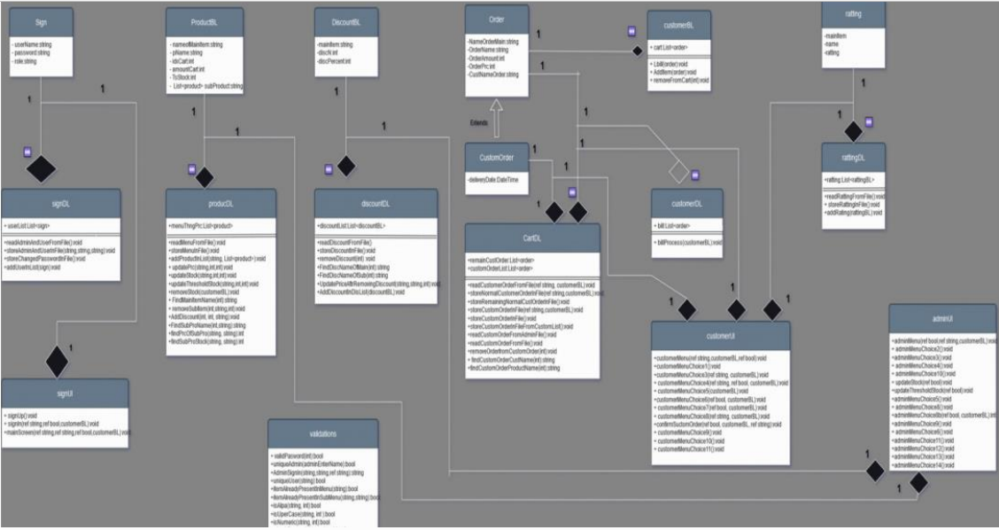
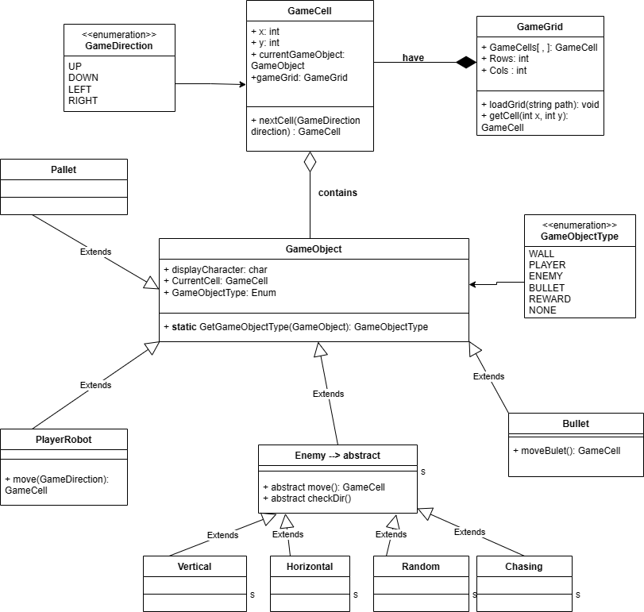

# Second Semester Overview

Hi, myself Tayyba Haider!

I am a *(at the time of writing)*, a sophomore at the famed University of Engineering and Technology, Lahore.

This repository gives an overview of my second semester, here at the Computer Science department.

To clone this repository, run the command anywhere in your local console.

```
git clone https://gitlab.com/tayyba123/secondsemester
```

## ApplicationWithCustomOrder / AppWithG

This is an extension of my Bakery Management System I developed in first semester. Both are actually the same thing, but ApplicationWithCustomOrder is the Console App backend, while AppWithG is the GUI frontend utilizing the same backend.

The FrontEnd is developed in Windows Forms Framework of .NET . Below is the CRC of that project.




## MyGame / MyPackman

MyPackman contains the source code for a pacman clone developed in c#. 

MyGame is the extension of the said framework in c#. I implemented it in a robots fighting game. Below you can find the CRC of the said framework.



Pacman by default has the same class relationships, but without the Bullet class.

## PythonBoot

This folder contains elementary starter files on a beginner to python.